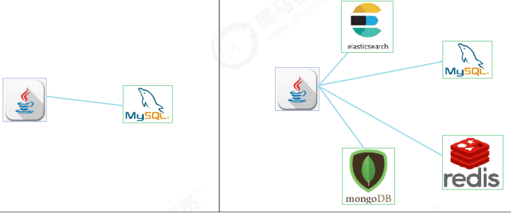
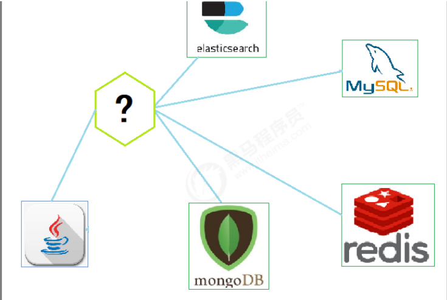

# 项目介绍

本项目是一个spring-data入门教程,通过本项目你可以了解到如何使用spring-data.

# 什么是spring-data?

​	随着互联网技术的发展，现在的企业开发中用到的用于数据存储的产品，不再仅仅是关系型数据库，而是要根据场景需要选择不同的存储技术，比如用于缓存热点数据的redis，用于存储文档数据的mongodb，用于支持强大搜索功能的elasticsearch等等。

​	在Java中，对于上面所说的产品都提供了优秀的访问技术。比如针对关系型数据库的mybatis、jpa等技术，针对于redis的jedis技术等等..... 这些技术虽然可以很好的针对各个存储产品进行访问操作，但同时也带来了新的问题，那就是不同的持久层技术的API是不一样的。
​	这样一来，开发人员就必须同时掌握多种数据访问技术，这无疑增加了开发成本。那么我们会想，
有没有这样一种技术，它可以使用一套API支持各个不同的存储的访问呢？就在这样的需求下，
SpringData产生了。

**SpringData**是一个用来简化dao层开发的框架。它在保证了各个底层存储特性的同时，提供了一套 统一的数据访问API。它可以很好的支持常用的关系型数据库和非关系型数据库。 使用SpringData作为dao层开发技术，将大大简化代码量，而且其API比各个技术的原生API更加简 单易用。

  SpringData支持的持久层技术非常多，我们只介绍几个常见的： 

- **Spring Data common**: SpringData的核心模块，定义了SpringData的核心功能
-  **Spring Data JDBC**: 对JDBC的Spring Data存储库支持
-  **Spring Data JPA**: 对JPA的Spring Data存储库支持 
- **Spring Data MongoDB**: 对MongoDB的基于Spring对象文档的存储库支持 
- **Spring Data Redis**: 封装Jedis技术，对redis实现访问操作 
- **Spring Data Elasticsearch**: 对Elasticsearch实现访问操作
